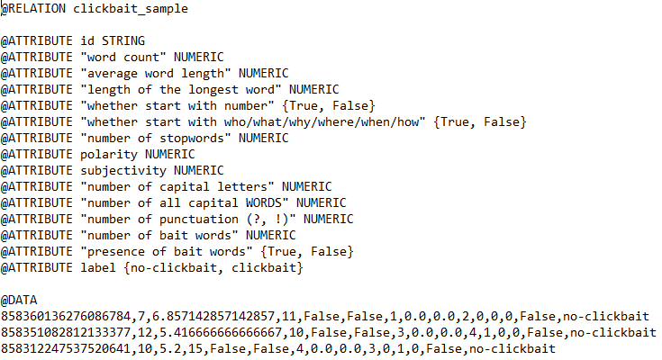
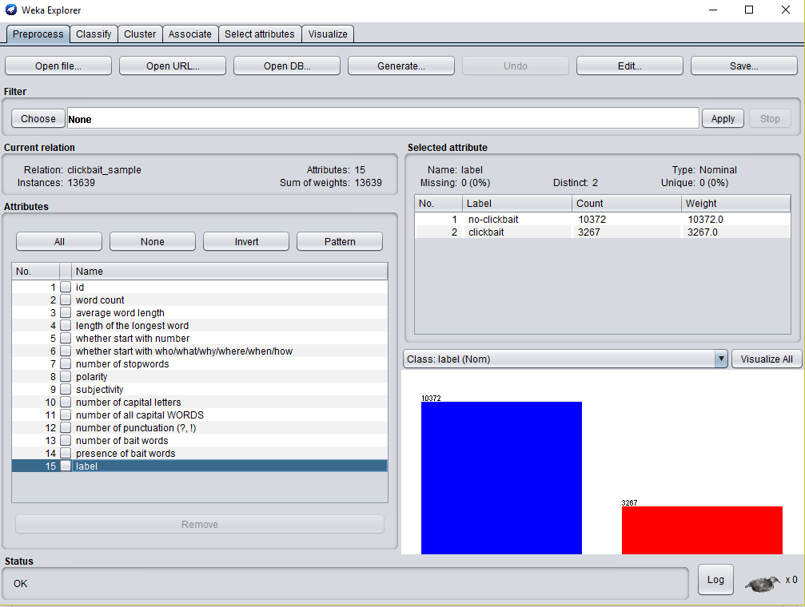
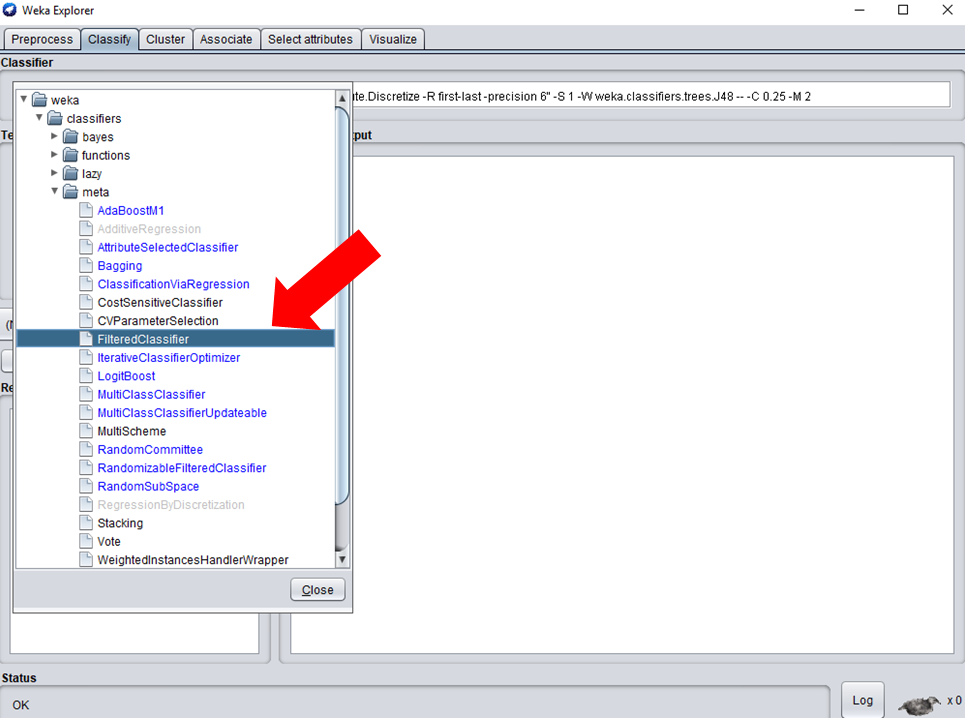
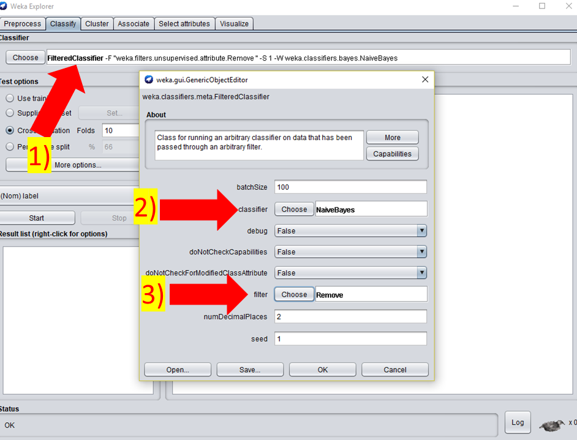
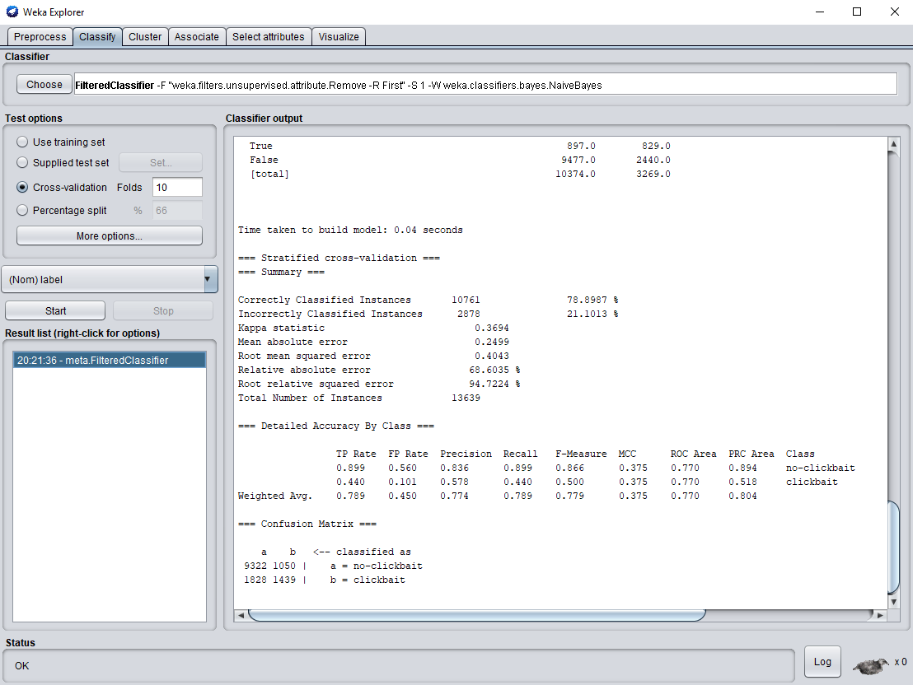
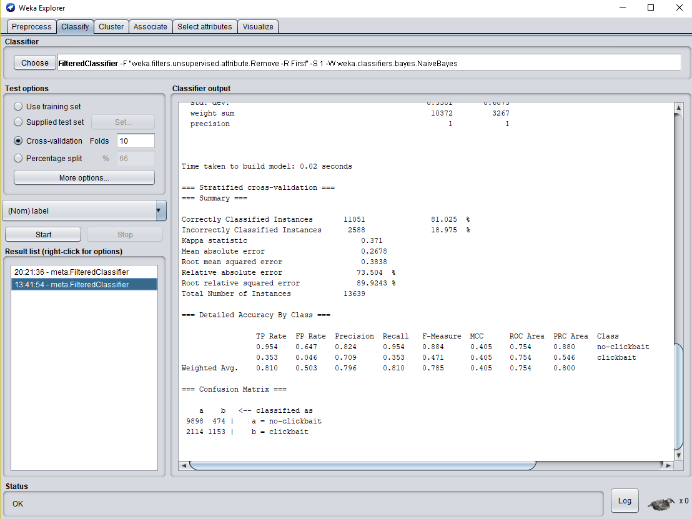
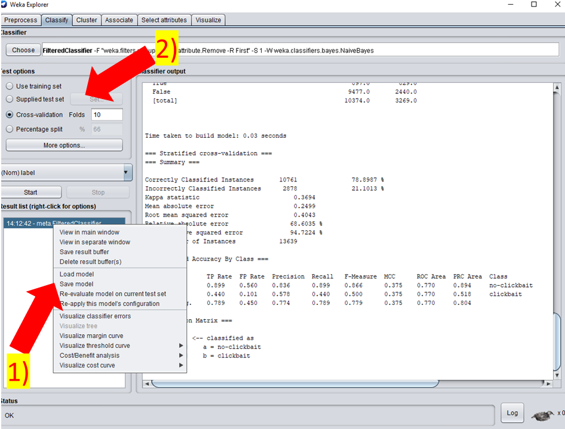
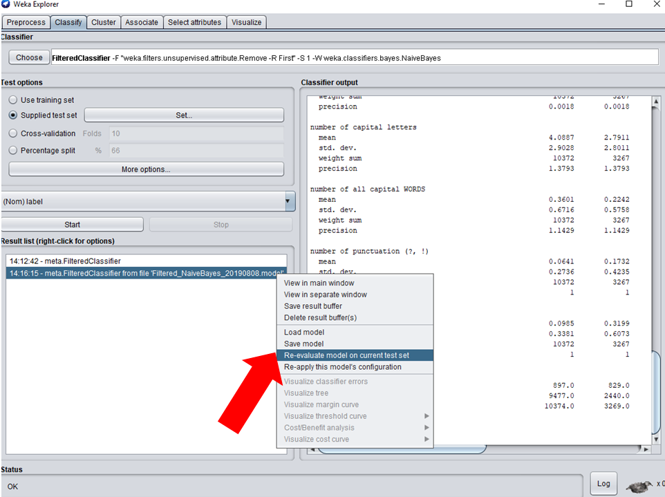
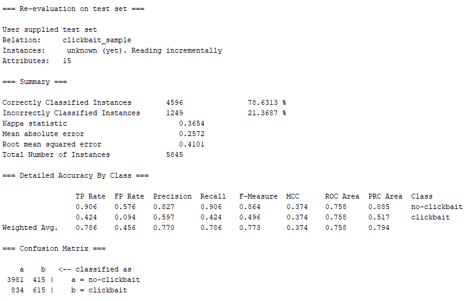

**Note:** This repository is part of a programming task of Sungkyunkwan University's ["Using Data Science to Detect Frauds and Fakes"](https://summer.skku.edu/_res/summer/etc/Data&Phy_A1.pdf "Class Syllabus") class. Students were advised to do some feature engineering first and then evaluate the dataset with [Weka](https://www.cs.waikato.ac.nz/ml/index.html "Weka Homepage"). Weka is a collection of machine learning algorithms for data mining tasks. It contains tools for data preparation, classification, regression, clustering, association rules mining, and visualization (from Weka's [homepage](https://www.cs.waikato.ac.nz/ml/weka/index.html "Weka Homepage")).

# About
We want to build a classfication model that is able to [detect clickbait posts in social media](https://www.clickbait-challenge.org "Clickbait Challenge"). 

This repository is divided into two parts. First, we need to download the dataset and need to create some features for our classfication model. After that, I will post a detailed guide how to train and test a classification model in Weka below.

# Clickbait Challenge Dataset
The Clickbait Challenge dataset provides a JSON file with 19538 examples (Twitter posts linking a news article). This is an example Twitter post from the dataset: [Ban lifted on Madrid doping laboratory](https://twitter.com/bbcworld/status/858224473597779969?lang=en "Twitter Post") and in the JSON file it looks like this:

```
from instances.jsonl

{
 "id": "858224473597779969",
 "postTimestamp": "Sat Apr 29 07:40:34 +0000 2017",
 "postText": ["Ban lifted on Madrid doping laboratorys"],                     #Twitter post
 "postMedia": [""],                                                           #if the Twitter post has an image attached 
 "targetTitle": "World Anti-Doping Agency lifts ban on Madrid laboratory",    #actual article headline/article
 "targetDescription": "Madrid's Anti-Doping Laboratory has its...",           #description below a headline
 "targetKeywords": "",
 "targetParagraphs": [                                                        #article text. One sentence is one list element
 "Share this with", 
 "Madrid's Anti-Doping Laboratory has had its suspension lifted...", 
 "The laboratory was sanctioned in June 2016 after Wada said the Spanish...",
 ...],
 "targetCaptions": ["Samples in an anti-doping laboratory..."]                #photo captions in the article 
} 

```

To make it simple, we will only use the "postText" key from the dataset for now. This key contains the written text of a Twitter post.

# Dataset and Feature Engineering
Download the dataset on the [Clickbait Challange homepage](https://www.clickbait-challenge.org "Clickbait Challenge") (latest release date: June 30, 2017). The .zip file contains `instances.jsonl` and `truth.jsonl` that we need later.

Weka requires an `.arff` file in order to run Machine Learning models. A `.arff` file looks like this:



We need to write in the `.arff` file what kind of attributes we want to use (**@ATTRIBUTE**) and in **@DATA** one line represents one training/test example with our feature attributes. If you want to add or remove any features, just edit the methods in `extract_features.py` and then edit `preprocessing.py` as well (specifically start to edit at line **34, 49 and 81**). 

I'm using the following features (that may or may not be useful, feature selection can be done later):

* `id` ID of an example
* `word count` How many words are in one Twitter post
* `average word length`
* `length of the longest word`
* `whether start with number` (e.g. 10 Destinations You Need to Visit, 5 Things You Need to Know)
* `number of stopwords` (clickpost tend to have longer, complete sentences, so maybe they have more stopwords)
* `polarity` (How polar is a post? Taken from Textblob library)
* `subjectivity` (How subjective is a post? Taken from Textblob library)
* `number of capital letters`
* `number of all capital WORDS`
* `number of puctuation (?, !)`
* `number of bait words` (I created a list that contains usual clickbait words like "best", "need", "should", "most" etc.)
* `presence of bait words`
* `label` ("no-clickbait or clickbait)


Again, these features may or may not be useful for this task. You need to test it or feature engineer more features. I took some inspiration from [Chakraborty et al. (2016)](https://www.researchgate.net/publication/310809794_Stop_Clickbait_Detecting_and_preventing_clickbaits_in_online_news_media "Paper").

# Requirements
* Download the latest [Weka](https://www.cs.waikato.ac.nz/ml/weka/downloading.html "Weka") version.
* to create an `.arff` file, you need to download the [arff library](https://pypi.python.org/pypi/liac-arff) in your environment: `pip install liac-arff`

# Usage

## Preprocessing

After downloading the dataset, run the `preprocessing.py` file to create an `.arff` file for Weka. Run this command:

```
python preprocessing.py --path_training <location of instances.jsonl>
                        --path_truth <location of truth.jsonl>
                        --output_path_training <location you want to save the training .arff file>
                        --output_path_test <location you want to save the test .arff file>
                        --size_test_set <how much of the dataset should be set aside for the test set(float)? (default 0.3)>
```

## Training in Weka
Now we can use our dataset in Weka.

1. Open Weka Explorer and open our `clickbait_training.arff` file ("Open File"). Our training file consists of 13639 examples (70% of the dataset) and the ratio is 76% no-clickbait posts and 24% clickbait post. Unfortunately, this dataset is not balanced (almost three times more no-clickbait posts than clickbait posts) Therefore, our model should hopefully output an accuracy higher than 76% accuracy (because we could achieve an accuracy score of 76% if we just mark every example as "no-clickbait"). 



2. Let's use a basic [Naive Bayes classifier model](https://en.wikipedia.org/wiki/Naive_Bayes_classifier "Naive Bayes") for this task first. Open the `Classify` tab and choose a Filtered Classifier: `weka->classifiers->meta->FilteredClassifier`. 
If you have used Weka before, you may wonder why not use the Naive Bayes classifier immediately (`weka->classifiers->bayes->NaiveBayes`) instead of a `FilteredClassifier`? It's because of the first feature in our preprocessed file `ID (of an example)`. Normally, you would just add numeric (e.g. `word count`) or nominal features (e.g. `whether start with number`) in an `.arff` file. In that case, you could directly use Weka models on the dataset. The `ID` of an instance is neither numeric nor nominal so this is something that a Weka model can't process and we need a `FilteredClassifier` for that. With a `FilteredClassifier` we can tell the model to ignore a feature during training but still keep it in the datatset. I decided to add the `ID` in the .arff file so I can output predictions during test time later (`e.g. ID: 858224473597779969, prediction: "clickbait"` as a .txt or .csv file) if necessary.



3. Click on "FilteredClassifier" (1). Choose from "classifier" tab `NaiveBayes (weka->classifiers->bayes->NaiveBayes)`(2). Then choose from the "filter" tab `weka->filters->unsupervised->attribute->Remove` (3). With this, we can ignore an attribute during training time. Click on "Remove" and type "First" in the `attributeIndices` tab. This will ignore our first feature (`ID`) during training time.



4) Now press `Start` to train our Machine Learning model. You can use either `Use training set`, `Cross-validation` or `Percentage split`. I use 10-Folds Cross-validation for now. Weka prints out an overview of our results with many useful scores:



As we can see, our Naive Bayes model classified 10761 correct examples (**78.9%**) and 2878 incorrect examples (**21.1%**). So at least, it is a bit better than our initial dataset distribition split (76%/24%). However, a bit alarming is the low "True Positive" (TP) rate of 0.440 for clickbait posts and the high "False Positive" (FP) rate of 0.560 (marking clickbait posts as no-clickbait) respectively. This means that our current model is bad at detecting clickbait posts when it sees one.   

 **Confusion matrix of our Naive Bayes Model**

 |   a  |  b   | <-- classified as
 |------|------|-------------------
 | 9322 | 1050 |  a = no-clickbait
 | 1828 | 1439 |  b = clickbait
 
 
Weka has an "Attribute Selection" feature which can calculate the most useful features for our dataset (see a Weka video tutorial [here](https://www.youtube.com/watch?v=Pf9yKjSiVnw&ab_channel=WekaMOOC "Attribute Selection"). After running it, out of the initial 14 features (word count - presence of bait words), we just keep `word count`, `length of the longest word`, `whether start with number`, `whether start with question word`, `number of capital letters` and `number of bait words`. This increases our accuracy to **81%** but the FP rate is increasing as well. 




 |   a  |  b   | <-- classified as
 |------|------|-------------------
 | 9898 | 474  |  a = no-clickbait
 | 2114 | 1153 |  b = clickbait


## Testing in Weka

After training our model, save the model (right-click on the model: `Save Model` on your disk). Upload the saved model right again (right-click `Load Model`) (1). Then click on "Supplied test set" and load our test set (`clickbait_test.arff`) file as test set (2).



Next, right-click on the loaded model and select `Re-evaluate model on current test set` and we get the results on our test set. 



Not surprisingly, the results are quite similar to our training set (since both are from the same distribution). 




 |   a  |  b   | <-- classified as
 |------|------|-------------------
 | 3981 | 415  |  a = no-clickbait
 | 834  | 615  |  b = clickbait


# Summary

This was a quick guide to Weka, how to train and test a classifier model. You can tell Weka to ignore a feature (e.g. `ID` in this case) during training so we can use this feature later for predictions if necessary. I chose the Naive Bayes model initially because it is a model that is easy to understand and it converts very fast (0.04 seconds) in Weka. There are more models that you can try in Weka that will give better results, so please try it out.   
